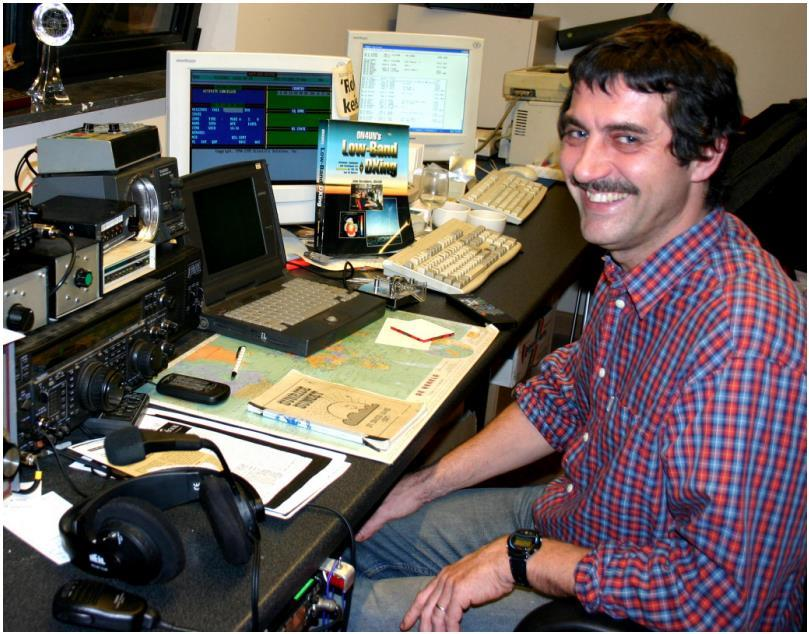

# The authors

John **ON4UN** was introduced to the wonderful world of amateur radio by his uncle Gaston **ON4GV**. John was merely 10 years old. Ten years later he obtained the call ON4UN. John’s interest in technology and science led him to become an engineer and his entire professional career was spent in the telecom world. All along he remained active on the bands, which has resulted in nearly half a million contacts in his logs.

In 1962, 1 year after he received his callsign, he took part in his first contest, the UBA CW contest, which he won. This was the beginning of a near 50 year long amateur radio career in which contesting and DXing especially on the lower HF bands have played a major role. On 80 meters John has the highest number of DXCC countries confirmed worldwide (he is holder of the DXCC 80m award #1 with over 355 countries confirmed) and on 160m he has the highest country total outside the US with over 300 countries confirmed. John also was the first station world wide to obtain the prestigious 5B-WAZ award.

In 1996, ON4UN represented Belgium at WRTC (_World Radio Team Championship_) in San Francisco together with his friend Harry ON9CIB. WRTC is commonly called the Olympic Games of Radio Contesting.

A highlight in John’s amateur radio career was undoubtedly his induction into the _CQ Contest Hall of Fame_ in 1997 and into the _CQ DX Hall of Fame_ in 2008, honours which until then had been bestowed upon only a handful of non-American hams. John wrote a number of technical books concerning our hobby, most of which are published by the ARRL (the American IARU Society). These covered mainly antennas, propagation and operational aspects concerning the lower HF bands. He also wrote technical software on the subject of antennae, including mechanical design of antennas and towers. Together with Rik ON7YD, he is the co- author of the UBA handbook for the HAREC-license. Already in 1963, as a very young ham, he got involved in Amateur Radio society affairs and became HF Manager for the UBA for a short period. More recently John served as President of the UBA between 1998 and 2007.

John combined his experience and expertise with that of his friend Mark ON4WW, to write this unique handbook _Ethics and Operational Procedures for the Radio Amateur_. A trigger to write this book was the enormous success of ON4WW’s article _Operating Practice_, which was incorporated in the UBA HAREC handbook. Operating Practice is available in more than 15 languages on Mark’s website, and has been published worldwide in a large number of ham radio magazines.

Mark **ON4WW** too, was barely 10 years young when he was bitten by the radio bug. His initial call in 1988 was ON4AMT, which he traded for ON4WW a few years later. Right from the start Mark was particularly interested in contesting, which may be one of the reasons for his special interest in correct operating procedures on the bands. In 1991 he met ON4UN and after some visits to John’s place he quickly became a CW buff and in addition a supporter of the more difficult HF bands, 80 and 160m. In the mid-nineties, Mark was one of the key operators at the OTxT contest station of the local UBA club TLS, a contest station which was located at ON4UN’s place. In that period this station won world wide first place (_multi-single_) three times as well as first places for Europe in several other CQWW contests.

In 1995 Mark joined the United Nations and went on a mission to Rwanda. In the following years he was sent on UN missions to several other African countries and each time he was active on the bands and especially on 160m and 80m (9X4WW, S07WW, EL2WW etc.). Later he showed up from Pakistan (AP2ARS) and Afghanistan (YA5T) as well as from Iraq (YI/ON4WW). Other calls Mark used in that period were JY8WW, J28WW and 9K2/ON4WW. Mark’s last mission for the UN was in Gambia (C5WW) in 2003.

In 2000 Mark realized one of his dreams, going on a major DXpedition. He was part of the record setting FO0AAA expedition to Clipperton Island in the Pacific, where the crew made 75,000 QSOs in just 6 days. In that same year he was also part of the A52A DXpedition to Bhutan. Still in that same year he represented Belgium, together with Peter ON6TT, at the WRTC in Slovenia where they scored first world wide in the SSB category. Two years later, in 2002, the same team represented our country again at WRTC in Finland.

Over the years Mark has gained a tremendous amount of operating experience. Specifically he has operated for long periods at both ends of the pileups. He has witnessed a lot of operating practice that was and still is today capable of vast improvement. Hence the publication of his article _Operating Practice_, and now his contribution to this more elaborate publication.
